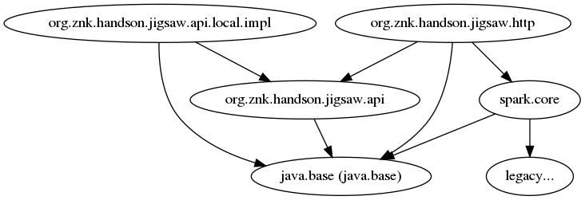

# Hands On Jigsaw

## Disclamer

Les données utilisées sont celles de l'API Marvel, elles appartiennent à Marvel et leur usage doit être accompagné de ce copyright.
> Data provided by Marvel. © 2014 Marvel

Pour plus d'informations https://developer.marvel.com/
(Aucun super héro n'a été maltraité durant ce hands-on)

Tout le reste du code est en usage libre sans aucunes restrictions. 

## Objectifs
Ce TP a pour objectif de commencer à se familiariser avec JIGSAW. Cette première mise en oeuvre permettra d'aborder les conceptes de bases en modularisation selon JIGSAW une application composé de 3 modules gradle.



## Etape 1 : Projet avant JIGSAW

S'assurer que tout fonctionne correctement.
 * Java 9 doit être installé et dans le PATH
 * Intellij doit importer les projets (en utilisant gradle)

Depuis le projet hands-on-jigsaw lancez les tests et packagez l'application
```sh
./gradlew clean check assembleDist
```
Les 3 tests doivent être OK

```sh
./gradlew run
```
Doit lancer le serveur web qui expose l'API
L'API est simpliste :
 *  http://localhost:8080/characters : tous(1) les personnages Marvel 
 *  http://localhost:8080/characters/{id} : Le personnage correspondant au paramètre **id** numérique ou erreur 404 avec un message json \"Not Found\"
 *  http://localhost:8080/characters/search/{containing} : Les personnages dont le nom contient le paramètre **containing**

(1) Ceux codés en dur dans le projet marvel-local-impl

## Etape 2 : premier module org.znk.handson.jigsaw.api

Il s'agit de modulariser le projet **api-marvel**, le module se nommera **org.znk.handson.jigsaw.api**. Il doit exposer l'interface et le bean qu'il contient pour que cela soit utilisable par d'autres modules.

Pour cela créez votre premier fichier module-info.java dans le répertoire .
Ce module va exposer le package **org.znk.handson.jigsaw.api**


Astuce : Regardez le fichier [TIPS.md](TIPS.md)


## Etape 3 : au tour du module org.znk.handson.jigsaw.api.local.impl

Le projet d'implementation **marvel-local-impl** contient une partie de l'API characters de Marvel (en dur).

Ce module s'appellera **org.znk.handson.jigsaw.api.local.impl**.
Il devra fournir une implementation de **org.znk.handson.jigsaw.api.CharactersApi** avec **org.znk.handson.jigsaw.api.local.impl.InMemoryCharactersApi**.
Ce module aura donc besoin de ... (pensez que cette dépendance doit être propagé)

Astuce : voir l'astuce précedente...

## Etape 4 : modifions le build gradle pour que cela soit pris en compte

Modifiez le fichier build.gradle du projet précédent pour AJOUTER :


```groovy
 // nom du module qui sera utilisé par la suite
 ext.moduleName = "org.znk.handson.jigsaw.api.local.impl"
 

 compileJava {
 
     inputs.property("moduleName", moduleName) // add modulename properties
     doFirst {
         // use module-path instead of classpath (and reset it)
         options.compilerArgs = [
                 '--module-path', classpath.asPath,
         ]
         classpath = files() // clean
     }
 }

```

Cela permet de remplacer dans le build le classpath par le module-path (cf Astuce...)

La commande ./gradlew -d compileJava vous permettra de retrouver ces options de compilations qui sont transmis au démon gradle
(astuce  | grep "Compiler arguments" peut faire gagner du temps) 

## Etape 5 : le dernier module : org.znk.handson.jigsaw.http

Cette fois le fichier module-info.java devra utiliser **org.znk.handson.jigsaw.api.CharactersApi** (via le ServiceLoader).
Ce module dépendra de 2 autres modules, dont spark qui sera un auto-module (module créer automatiquement à partir du nom du jar sans la version et en remplaçant les - par des .)

Comme le module **org.znk.handson.jigsaw.api.local.impl** qui fournit l'implementation de **org.znk.handson.jigsaw.api.CharactersApi** déclare cela dans sa définition de module, vous pouvez supprimer le fichier qui le définit en tant que provider : marvel-local-impl/src/main/resources/META-INF/services/org.znk.handson.jigsaw.api.CharactersApi

## Etape 6 : Un peu de refactoring de gradle

Vous pouvez définir pour chaque module les options qui seront passé au compilateur, ou le faire une fois pour toute dans le projet root de gradle.

Modifier le fichier hands-on-jigsaw/build.gradle : ajouter (à la suite des options sur les versions java : source & target)

```groovy
compileJava {

    inputs.property("moduleName", moduleName) // add modulename properties
    doFirst {
        // use module-path instead of classpath (and reset it)
        options.compilerArgs = [
                '--module-path', classpath.asPath,
        ]
        classpath = files() // clean
    }
}


```

La property **moduleName** sera fournie par chaque module. Il faut donc dans chaque fichier **build.properties** du
 * Projet **api-marvel** ajouter
```groovy
ext.moduleName = "org.znk.handson.jigsaw.api"
```
 * Dans le projet **marvel-local-impl** supprimer le bloc compileJava (qui est définit par le "parent")
 
## Etape 7 : Un run qui est basé sur les modules

Le module **org.znk.handson.jigsaw.http** est le module qui contient la main classe.

Le run actuel utilise le classpath, pas les modules.

Dans un module pour lancer une main classe il faut utiliser l'option --module en lui spécifiant le nom du module et le nom complet de la main classe.

Il faut donc remplacer
```groovy
mainClassName = 'org.znk.handson.jigsaw.http.Application'
```
par
```groovy
mainClassName = "$moduleName/org.znk.handson.jigsaw.http.Application"
```

Il faut aussi modifier le run pour qu'il intègre les nouveaux arguments

```groovy
run {
    inputs.property("moduleName", moduleName)
    doFirst {
        jvmArgs = [
                '--module-path', classpath.asPath,
                '--module', mainClassName // use module instead of classpath
        ]
        classpath = files()
    }
}
```

Astuces: voir TIPS...

## Etape 8 : Un build qui génère une application avec des scripts de démarrage qui "parlent modules"

Gradle à un task **assembleDist** qui permet de générer des archives (zip et tar) contenant les librairies de l'application et script de démarrage. 
Ces scripts n'utilise pas les modules mais le classpath.
Ici il s'agit de modifier le build gradle pour générer ces scripts sh & bat de lancement qui soit "modules compatibles".

Modifier le fichier ./consume-api-marvel/build.gradle :
 * Ajoutez un bloc startScript qui utilise le module-path et la main façon module
```groovy
startScripts {
    inputs.property("moduleName", moduleName)
    doFirst {
        classpath = files()
        defaultJvmOpts = [
                '--module-path', 'APP_HOME_LIBS', // Multi plateform replace in doLast
                '--module', mainClassName
        ]
    }
    doLast{
        def bashFile = new File(outputDir, applicationName)
        String bashContent = bashFile.text
        bashFile.text = bashContent.replaceFirst('APP_HOME_LIBS', Matcher.quoteReplacement('$APP_HOME/lib'))

        def batFile = new File(outputDir, applicationName + ".bat")
        String batContent = batFile.text
        batFile.text = batContent.replaceFirst('APP_HOME_LIBS', Matcher.quoteReplacement('%APP_HOME%\\lib'))
    }
}

```
 * Ce block à besoin d'un matcher, n'oubliez pas de l'importer au début du buid.gradle
```groovy
import java.util.regex.Matcher
```

Pour tester cela
```bash
./gradlew assembleDist
```
Et allez voir et tester le contenu des archives du répertoire consume-api-marvel/build/distributions (les scripts de lancement)

## Etape 9 : Et des tests unitaires qui utilisent les modules

Vous pouvez constater avec ./gradlew -d check que les tests unitaires sont exécutés en utilisant le classpath au lieu des modules.
Pour corriger cela il faut modifier le processus de build des tests et d'exécutions des tests.

Il vous faut redéfinir le task compileTest pour :
 * Utiliser le module-path à la place du classpath
 * Ajouter l'auto-module junit
 * Permettre à notre module d'utiliser junit
 * Patcher le module pour ajouter le code des tests : avec gradle l'on obtient cette liste de fichiers à inclure avec l'instruction 
 En phase de compilation
 ```groovy
 files(sourceSets.test.java.srcDirs).asPath
 ```
 En phase d'exécution
  ```groovy
  files(sourceSets.test.java.outputDir).asPath
  ```
 

```groovy
compileTestJava {
    inputs.property("moduleName", moduleName)
    doFirst {
        options.compilerArgs = [
                // TODO inspirez vous de ce qui est fait dans le task compileJava et regardez les TIPS
        ]
        classpath = files()
    }
}
```

Il faut faire la même chose à l'exécution des tests. Attention outre junit il faut faire la même chose pour hamcrest (librairie utiliser dans les tests)

```groovy
test {
    inputs.property("moduleName", moduleName)
    doFirst {
        jvmArgs = [
                '--add-modules', 'ALL-MODULE-PATH', // TIPS pour inclure notament le Gradle test runner en tant que module
                // TODO inspirez vous de ce qui est fait dans le task compileJava et regardez les TIPS


        ]
        classpath = files()
    }

    // ...
    
}
```


## Etape 10 optionnel : Un plugin gradle pour JIGSAW 

Utilisez un plugin expérimental pour utiliser JIGSAW sans avoir besoin de spécifier les task de compilation et d'exécution.

https://github.com/zyxist/chainsaw

```groovy

plugins {
  // ...
  id "com.zyxist.chainsaw" version "0.1.3"
}


javaModule.name = 'nom.de.mon.module'

```

Attention ce plugin est encore en développement et vous risquez de rencontrer quelques difficultés avec les tests unitaires


## Etape 11 optionnel : Packagez votre application avec une jlink

Jlink permet de générer une application packagée et optimisée avec sa JVM. 
Cela produit un plus petit livrable qu'un JRE + application qui démarre plus vite avec une empreinte plus faible.

 * Créez un nouveau module (avec le fichier build.gradle)
 * Ajoutez une nouvelle main class qui permet d'accéder à l'API en ligne de commande
```java
public class Application {
    private static CharactersApi charactersApi = ServiceLoader.load(CharactersApi.class).findFirst().get();
    public static void main(String[] args) {
        if(null == args || args.length < 1) {
            System.out.println("Args required : desc {id} | search {containing}");

            System.exit(1);
        }
        final String action = args[0].toLowerCase().trim();
        final String arg = args[1].trim();

        switch (action) {
            case "desc" :
                Optional<MarvelCharacter> character = charactersApi.find(Integer.valueOf(arg));
                character.ifPresentOrElse(c ->
                   System.out.printf("%s\n-------------------------\n%s", c.name, c.description)
                , () ->
                    System.out.printf("Find no characters with the id <%s>\n", arg)
                );
                break;
            case "search" :
                final List<MarvelCharacter> characters = charactersApi.findByNameContaining(arg);
                System.out.printf("Find %d character(s)\n", characters.size());
                characters.forEach(c -> System.out.printf("\t%d - %s\n", c.id, c.name));
                break;
            default:
                System.out.println("Unknow arg");
                System.exit(1);
        }
        
    }
}
```        
 * Créez le fichier module-info.java
 * Utilisez jlink pour générer la JVM avec les modules un *launcher* associé à cette main class 
 


